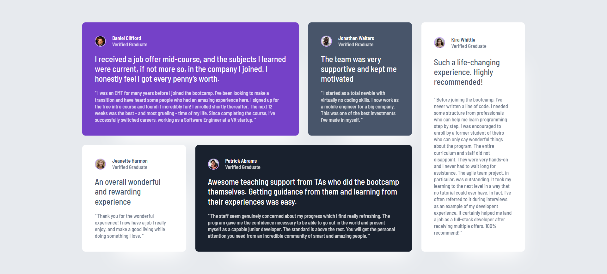

# Frontend Mentor - Testimonials grid section solution

This is a solution to the [Testimonials grid section challenge on Frontend Mentor](https://www.frontendmentor.io/challenges/testimonials-grid-section-Nnw6J7Un7). Frontend Mentor challenges help you improve your coding skills by building realistic projects. 

### The challenge

Users should be able to:

- View the optimal layout for the site depending on their device's screen size

### Screenshots

<table>
  <tr>
    <td></td>
    <td></td>
  </tr>
</table>

### Links

- Solution URL: https://www.frontendmentor.io/solutions/testimonials-grid-with-sass-e5RyqJhFz6
- Live Site URL: https://mzdemir-testimonials-grid.netlify.app/

### Built with

- Semantic HTML5 markup
- Sass
- CSS Grid Layout
- Mobile-first workflow
- Accessibility

## Author

- Website - https://github.com/mzdemir
- Frontend Mentor - https://www.frontendmentor.io/profile/mzdemir